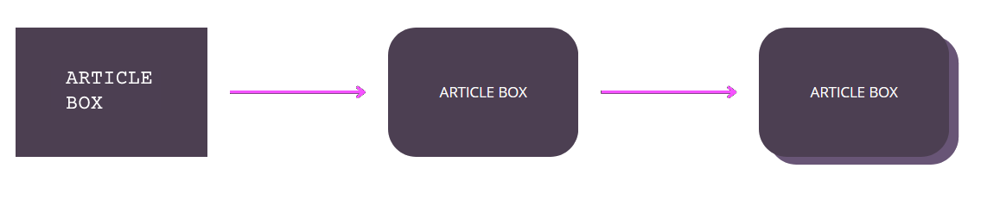

# Idea iniziale
Nella fase di mockup del sito, abbiamo scelto di adottare uno stile arrotondato e di integrare vari elementi floating. Questa decisione è stata guidata dal nostro obiettivo di creare un sito mobile-first, che avesse un aspetto e una sensazione simile a quella di un'app, piuttosto che di un tradizionale sito desktop. L'utilizzo di Bootstrap ci ha permesso di realizzare elementi floating che possono essere riarrangiati dinamicamente in base alle dimensioni del display. Su uno smartphone, gli elementi si dispongono verticalmente per una navigazione più agevole, mentre su dispositivi più grandi sfruttano lo spazio disponibile posizionandosi uno accanto all'altro, garantendo così un'esperienza utente ottimale su qualsiasi dispositivo.

## Navbar

## Pulsanti

## Blocchi di testo

